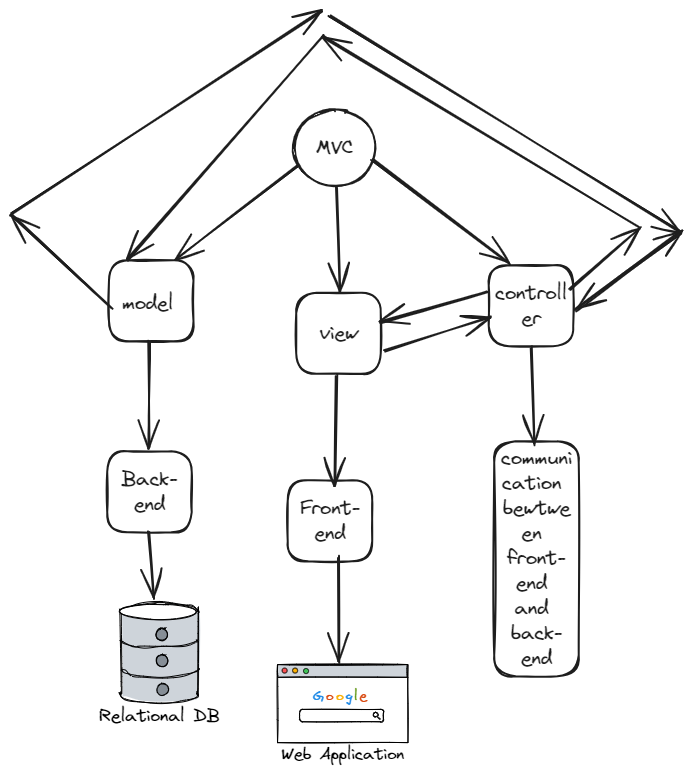

# New_Project

## Apraksts
**New_Project** ir mācību projekts, kura mērķis ir parādīt, kā pareizi noformēt dokumentāciju projektiem. Tas ietver galvenās sadaļas, kas ir nepieciešamas, lai jebkura projekta dokumentācija būtu saprotama un strukturēta.

Šī dokumentācija palīdz saprast, kuri galvenie komponenti ir svarīgi, kā aprakstīt arhitektūru, uzstādīšanas procesus, kā arī sniedz norādes par ieguldījumu un testēšanu.

## Mērķi
Galvenais projekta mērķis ir kalpot par paraugu dokumentācijas izveidei. Šis projekts ietver šādus mērķus:
- Nodrošināt veidni strukturētai dokumentācijai
- Piedāvāt piemēru arhitektūras, uzstādīšanas, darbības un testēšanas aprakstiem
- Palīdzēt jauniem projekta dalībniekiem ar soli pa solim instrukcijām

---

## Projekta arhitektūra

**New_Project** sastāv no šādām galvenajām komponentēm:

1. **Frontend**:
   - **Apraksts**: Lietotāja saskarne, kas nodrošina mijiedarbību ar sistēmu.
   - **Tehnoloģijas**: HTML, CSS, JavaScript (Reactю.js)
   - **Funkcijas**: Nodrošina galvenās funkcijas, piemēram, navigāciju, datu attēlošanu, kā arī piekļuvi galvenajām sistēmas funkcionalitātēm.

2. **Backend**:
   - **Apraksts**: Servera puse, kas pārvalda biznesa loģiku, datu apstrādi un API.
   - **Tehnoloģijas**: Node.js, Fast API vai Flask.
   - **Funkcijas**: Datu apstrāde, lietotāju autentifikācija, API loģika.

3. **Datu bāze**:
   - **Apraksts**: Sistēma datu glabāšanai un apstrādei.
   - **Tehnoloģijas**: PostgreSQL.
   - **Funkcijas**: Lietotāju datu, sistēmas iestatījumu un citu datu glabāšana un atgūšana.

---

